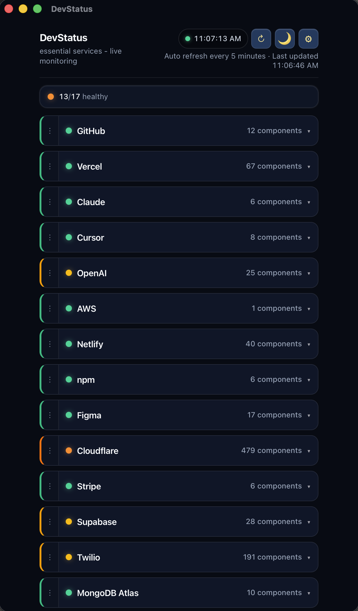
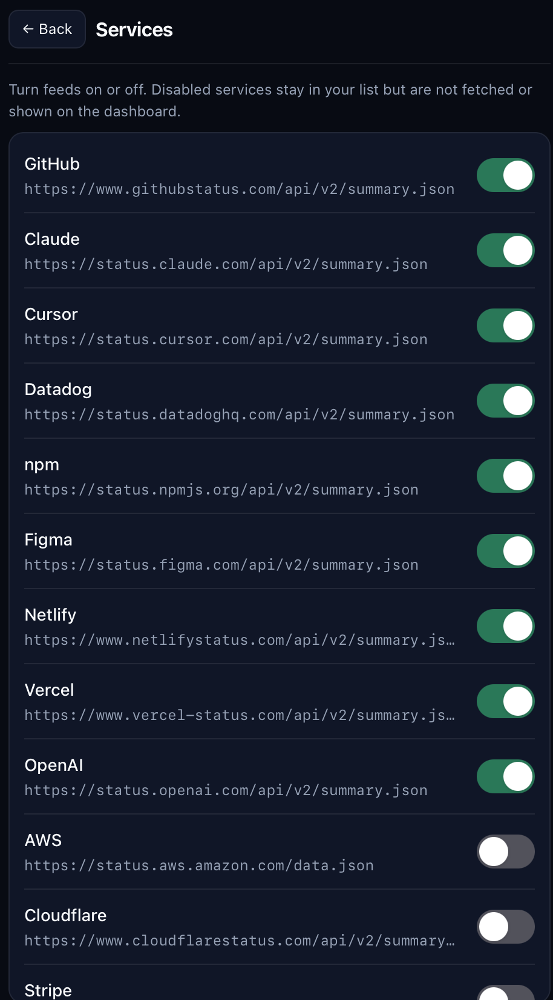

<!-- markdownlint-disable MD033 MD041 -->

<h1 align="center">DevStatus</h1>

<p align="center">
  <strong>Live dashboard for public developer-service status pages — desktop & web</strong>
</p>

<p align="center">
  <a href="https://github.com/jboho/dev-status/actions/workflows/ci.yml"></a>
  <a href="https://github.com/jboho/dev-status/blob/main/CONTRIBUTING.md"></a>
  <a href="https://calver.org/"></a>
  <a href="https://v2.tauri.app/"></a>
  <a href="LICENSE"></a>
</p>

<p align="center">
  <sub>In-product name: <em>DevStatus</em> · essential services · live monitoring</sub>
</p>

---

## Overview

**dev-status** aggregates **public** incident and component feeds (mostly [Atlassian Statuspage](https://developer.statuspage.io/) `summary.json`-compatible APIs, plus AWS’s status JSON) into one glanceable view: overall health, per-provider indicators, and expandable component detail. Run it as a **native desktop app** ([Tauri](https://tauri.app/)) or in the **browser** during development.

| Topic               | Links                                                                                        |
| ------------------- | -------------------------------------------------------------------------------------------- |
| **License**         | [MIT](LICENSE)                                                                               |
| **Changelog**       | [CHANGELOG.md](CHANGELOG.md)                                                                 |
| **Contributing**    | [CONTRIBUTING.md](CONTRIBUTING.md)                                                           |
| **Security**        | [SECURITY.md](SECURITY.md)                                                                   |
| **Code of conduct** | [CODE_OF_CONDUCT.md](CODE_OF_CONDUCT.md)                                                     |
| **Versioning**      | [CalVer](https://calver.org/) `YYYY.M.MICRO` · bump `package.json`, then `pnpm version:sync` |

## Screenshots

| Dashboard                                                                                                                | Services                                                                                     |
| ------------------------------------------------------------------------------------------------------------------------ | -------------------------------------------------------------------------------------------- |
|  |  |

The **dashboard** shows a live health summary across all enabled services. Each card displays the overall status and component count; clicking expands it to show individual components with their current status (Operational, Partial Outage, Major Outage, etc.). The header shows the auto-refresh interval and time of last update.

The **services screen** lets you toggle any feed on or off individually. Disabled services remain in your list but are excluded from polling and the dashboard view. Each entry shows the underlying status API URL.

## Features

- **Live dashboard** — Health cards for every enabled service showing overall status and component count at a glance. A header counter (e.g. _9/14 healthy_) gives an instant read on how many services are degraded.
- **Component drill-down** — Click any card to expand it and see per-component status: Operational, Partial Outage, Major Outage, or Degraded Performance. Each expanded card links out to the service’s full status page.
- **Auto-refresh** — Automatic polling (default **every 5 minutes**) plus manual refresh; requests avoid stale HTTP caches so you always see current data. A manual refresh button and “last updated” timestamp are always visible in the header.
- **Desktop notifications** — On each poll, the app diffs the page-level `status.indicator` for every enabled service against the previous result. If anything changed, it fires a single bundled OS notification — title _”DevStatus”_, body listing each affected service as `ServiceName: from → to` (e.g. `Claude: none → minor`). No notification fires on the first load (no baseline yet), so you won’t get a flood on startup. Tauri-only; the app requests OS permission on the first trigger.
- **Per-service toggles** — Toggle providers on or off without deleting them from your list. Disabled services are excluded from polling and the dashboard.
- **Statuspage-compatible** — Consumes the standard Statuspage `summary.json` API (`page`, `status`, `components`); **AWS** uses `status.aws.amazon.com/data.json`, normalized to the same shape. Adding a new service is a one-line config change.
- **Reorder** — Drag-and-drop card order, persisted across restarts.
- **Theme** — Light/dark, persisted (`localStorage` key `dev-status-theme` in the browser; desktop uses app storage).
- **Desktop shell** — Lives in the Dock; closing the window hides it (click the Dock icon to reopen) instead of quitting, config stored in the OS app-data directory, Rust-side `reqwest` for feeds that don't send CORS headers from the webview.

## Requirements

- **[Node.js](https://nodejs.org/)** 22+ (`engines` in [`package.json`](package.json); this repo includes [`.nvmrc`](.nvmrc) for `nvm use` / `fnm`)
- **[pnpm](https://pnpm.io/)** 10.x (`packageManager` in [`package.json`](package.json))
- **Rust + OS prerequisites** for `pnpm tauri:dev` / `pnpm tauri build` — see [Tauri prerequisites](https://v2.tauri.app/start/prerequisites/)

## Quick start

```bash
git clone https://github.com/jboho/dev-status.git
cd dev-status
pnpm install
```

**Web UI** (Vite dev server → `http://localhost:5173`):

```bash
pnpm dev
```

The dev server proxies `/api/aws-health` to AWS’s JSON so the **AWS** feed works in the browser without CORS issues.

**Desktop** (Tauri + Vite):

```bash
pnpm tauri:dev
```

## Project scripts

| Script               | Purpose                                                           |
| -------------------- | ----------------------------------------------------------------- |
| `pnpm dev`           | Vite dev server                                                   |
| `pnpm tauri:dev`     | Tauri shell + hot reload                                          |
| `pnpm build`         | Typecheck + production web build (`dist/`)                        |
| `pnpm preview`       | Serve `dist/`                                                     |
| `pnpm lint`          | [Oxlint](https://oxc.rs/docs/guide/usage/linter.html)             |
| `pnpm format`        | Prettier (write)                                                  |
| `pnpm format:check`  | Prettier (check, CI)                                              |
| `pnpm test`          | [Vitest](https://vitest.dev/) watch mode                          |
| `pnpm test:run`      | Vitest single run (CI)                                            |
| `pnpm test:coverage` | Vitest + v8 coverage report (`coverage/`, gitignored)             |
| `pnpm preflight`     | format → lint → `test:run`                                        |
| `pnpm version:sync`  | Sync `package.json` version → Tauri + Cargo (after version bumps) |

## Development

- **Tests** — Co-located `*.test.ts` / `*.test.tsx`, Vitest + Testing Library. Run `pnpm test` locally or `pnpm test:run` in CI. **`pnpm test:coverage`** produces a line/branch report (see [Coverage](#test-coverage) below).
- **Quality gate** — Prefer `pnpm preflight` before pushing.

### Test coverage

Coverage is **not** a required CI gate today. The HTML report (also uploaded as a **CI artifact** on `main` / PRs) excludes shadcn-style `src/components/ui/**`, test files, and `src/main.tsx`. Vitest only instruments code that the test run actually loads, so **screen and hook modules can be absent from the table until you test them** — in a recent run, covered lines were on the order of **~30%** among those hit modules, mostly **pure helpers** (`statusPageUrl`, `types`, `lib/utils`, parts of `awsHealthStatus` / `statusFetch`, `statusChange`). Improving coverage usually means adding React Testing Library tests and/or moving logic out of hooks into testable functions.

See [CONTRIBUTING.md](CONTRIBUTING.md) for CalVer releases, changelog expectations, and PR guidelines.

## Configuration

| Environment | Storage                                                                                                              |
| ----------- | -------------------------------------------------------------------------------------------------------------------- |
| Browser     | `localStorage` key `dev-status.config.v1`                                                                            |
| Tauri       | `config.json` under the app data directory (see `get_config_path` in [`src-tauri/src/lib.rs`](src-tauri/src/lib.rs)) |

Default providers and URLs live in [`src/configStorage.ts`](src/configStorage.ts) and are mirrored in the Rust default in `src-tauri/src/lib.rs`. Saved configs are merged with **new** defaults by service name so the list can grow without wiping user settings.

## Tech stack

| Layer   | Details                                                                                    |
| ------- | ------------------------------------------------------------------------------------------ |
| UI      | React 19, TypeScript, Vite 8, Tailwind CSS 4, `@base-ui/react`, `@dnd-kit`                 |
| Testing | Vitest, Testing Library, jsdom                                                             |
| Desktop | Tauri 2 — filesystem, opener, notification plugins; Rust (`reqwest`) for HTTP where needed |

## Building desktop installers

```bash
pnpm install
pnpm tauri build
```

Artifacts land under `src-tauri/target/release/bundle/` (layout depends on OS and [bundle targets](https://v2.tauri.app/reference/config/#bundle)). The same flow targets **macOS**, **Windows**, and **Linux**; you need the target OS (or CI) to produce that platform’s bundle.

- **Windows** — Requires a Windows environment or runner + [Windows prerequisites](https://v2.tauri.app/start/prerequisites/).
- **macOS** — Build on macOS (or a macOS runner). Local builds are ad-hoc signed and run fine on the machine that produced them. Release builds are signed with a Developer ID certificate and notarized by Apple — see [Releasing](CONTRIBUTING.md#macos-signing-and-notarization) for the required secrets.

**CI** — [`.github/workflows/ci.yml`](.github/workflows/ci.yml) runs **quality** on Ubuntu (lint, format, tests, **coverage artifact**, production web build, audit), then **desktop** on `windows-latest` and `macos-latest`, uploading bundle folders as workflow artifacts. [Dependabot](.github/dependabot.yml) opens weekly update PRs for npm, Cargo, and Actions.

## Contributing

Contributions are welcome. Please read [CONTRIBUTING.md](CONTRIBUTING.md), follow [CODE_OF_CONDUCT.md](CODE_OF_CONDUCT.md), and update [CHANGELOG.md](CHANGELOG.md) when your change warrants a release note.

## License

Published under the [MIT License](LICENSE).
